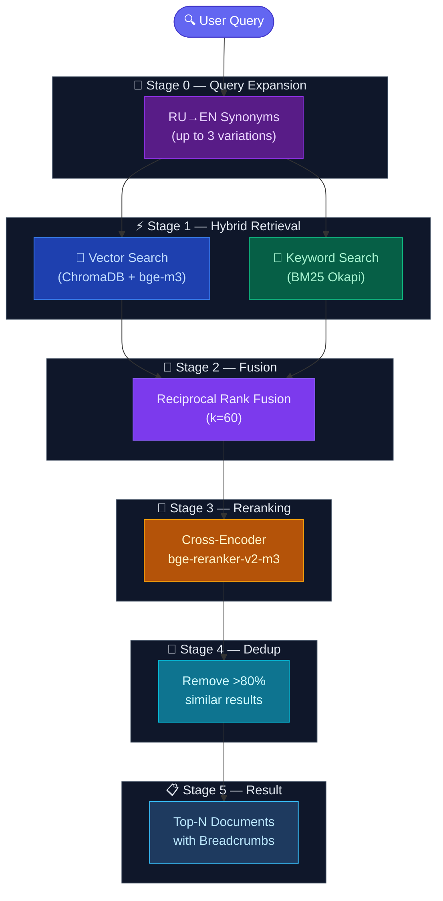

<div align="center">
  <h1>🧠 OmniDocs-RAG-CN</h1>

<strong>Universal RAG Knowledge Base for AI Agents — with Native Chinese Support 🇨🇳</strong>
<br/>
<em>Index local files, websites, GitHub repos, npm/PyPI packages — then search them with hybrid AI-powered retrieval. All through your IDE chat. 100% local, one-command install.</em>
<br/><br/>

<a href="https://opensource.org/licenses/Apache-2.0"></a>
<a href="https://www.python.org/downloads/"></a>
<a href="https://modelcontextprotocol.io/"></a>
<a href="https://trychroma.com/"></a>
<a href="https://huggingface.co/BAAI/bge-m3"></a>
<a href="README_CN.md"></a>
<br/><br/>

<a href="#-features">Features</a> •
<a href="#-quickstart">Quickstart</a> •
<a href="#️-architecture">Architecture</a> •
<a href="#-mcp-tools">Tools</a> •
<a href="#-chinese-support">Chinese Support</a> •
<a href="#-faq">FAQ</a>

</div>

---

## ✨ Features

### 🔍 Search Pipeline
- **Hybrid Search** — ChromaDB vector + BM25 keyword scoring fused via Reciprocal Rank Fusion (RRF, k=60)
- **Cross-Encoder Reranking** — `BAAI/bge-reranker-v2-m3` rescores top candidates for surgical precision
- **Query Expansion** — CN→EN + RU→EN synonym expansion for mixed-language documentation
- **Result Deduplication** — removes near-duplicate chunks (>80% similarity threshold)

### 📁 Universal Source Ingestion
- **40+ file formats** — `.md`, `.py`, `.js`, `.ts`, `.json`, `.yaml`, `.html`, `.csv`, and more
- **Binary documents** — PDF, DOCX, XLSX, PPTX, Jupyter Notebooks (optional packages)
- **Websites** — full async BFS crawler with boundary control, robots.txt, sitemap.xml
- **GitHub repositories** — direct API tree walking
- **npm / PyPI packages** — metadata + README extraction
- **ZIP archives** — automatic extraction and indexing
- **JS-rendered sites** — optional Playwright support for Docusaurus, GitBook, VitePress

### ⚡ Performance
- **GPU acceleration** — auto-detects CUDA (RTX 3080 = ~11x speedup)
- **Incremental indexing** — MD5 file hashing, only re-indexes changed files
- **Code-aware chunking** — Python files split by class/function via AST, JS/TS via regex
- **Heading-aware chunking** — Markdown split at `##`/`###` with 2-sentence overlap
- **BM25 persistence** — survives server restarts via pickle cache

### 🛠️ Management
- **Multi-collection** — separate knowledge bases per project
- **Auto-categorization** — YAML frontmatter → H1 heading → filename fallback
- **File Watcher** — auto-reindex on filesystem changes (watchdog, 2s debounce)
- **Admin tools** — list, remove, delete, reindex — all through chat
- **100% Local & Free** — no API keys, no Docker, no monthly fees

---

## 🏗️ Architecture



### How It Works

1. **Query Expansion** — generates query variations with CN→EN and RU→EN programming synonyms
2. **Hybrid Retrieval** — searches by semantic meaning (`bge-m3`, 8192 tokens) and exact keywords (BM25 + jieba Chinese tokenization) simultaneously
3. **Reciprocal Rank Fusion** — mathematically combines ranks from both engines
4. **Cross-Encoder Reranking** — `bge-reranker-v2-m3` deeply computes relevance for top candidates
5. **Deduplication** — removes near-identical results
6. **Structured Output** — results returned with breadcrumbs (e.g., `README.md > Quickstart > Installation`)

---

## 🚀 Quickstart

### 1. Prerequisites

- Python 3.10+ (Tested on 3.13)
- `git`

### 2. Install

```bash
git clone https://github.com/ybhuang995-dev/OmniDocs-RAG-CN.git
cd OmniDocs-RAG-CN
python install.py
```

The installer handles everything: pip dependencies, GPU detection + PyTorch install, AI model download (~2.3GB, one-time), and auto-configures your IDE's MCP connection.

> **⚠️ Enable GPU Acceleration (Crucial for Speed):**
> By default, `pip` may install the CPU-only version of PyTorch on Windows. To unlock your NVIDIA GPU, run:
> ```bash
> pip install torch torchvision torchaudio --index-url https://download.pytorch.org/whl/cu124 --upgrade --force-reinstall
> ```

### 3. Configure (if manual)

Add to your IDE's MCP config (`mcp_config.json`):

```json
{
  "mcpServers": {
    "markdown-rag": {
      "command": "python",
      "args": ["C:\\path\\to\\OmniDocs-RAG\\server.py"],
      "env": {
        "RAG_DOCS_PATH": "C:\\path\\to\\your\\docs",
        "RAG_DEVICE": "cuda"
      }
    }
  }
}
```

### 4. Use

Just talk to your AI assistant:

```
> Index my project docs
> Search: how does authentication work?
> Index the FastAPI documentation from https://fastapi.tiangolo.com
> Add the langchain repo: github://langchain-ai/langchain/docs
```

The AI calls the MCP tools automatically — no UI, no buttons, just chat.

---

## 🛠️ MCP Tools

| Tool | Description |
|---|---|
| `index_documents(path, collection)` | Index local files (40+ formats, incremental) |
| `index_url(uri, collection, ...)` | Index websites, GitHub, npm, PyPI, ZIP |
| `search_docs(query, n, category, filename, collection)` | Hybrid search with reranking |
| `rag_status(collection)` | Full system status: models, GPU, BM25, chunks |
| `list_collections()` | List all knowledge base collections |
| `list_indexed_files(collection)` | List files in a collection |
| `remove_source(filename, collection)` | Remove a file from the index |
| `delete_collection(name, confirm)` | Delete an entire collection |
| `reindex_collection(path, collection)` | Force full rebuild |

### `index_url()` — Universal Source Ingestion

```python
# Websites (async BFS crawler)
index_url("https://docs.python.org/3/library/asyncio.html")

# GitHub repositories
index_url("github://tiangolo/fastapi/docs")

# npm packages
index_url("npm://axios@1.6")

# PyPI packages
index_url("pypi://fastapi")

# ZIP archives
index_url("file:///path/to/docs.zip")
```

---

## ⚙️ Configuration

All settings via environment variables:

| Variable | Default | Description |
|---|---|---|
| `RAG_DOCS_PATH` | parent directory | Folder to scan for files |
| `RAG_DB_PATH` | `./chroma_db` | ChromaDB storage location |
| `RAG_DEVICE` | `auto` | `cuda` / `cpu` / `auto` |
| `RAG_EMBED_MODEL` | `BAAI/bge-m3` | Embedding model |
| `RAG_RERANK_MODEL` | `BAAI/bge-reranker-v2-m3` | Cross-Encoder model |
| `RAG_WATCH_PATH` | — | Directory to watch for auto-reindex |
| `RAG_WATCH_COLLECTION` | `docs_v4` | Collection for file watcher |
| `GITHUB_TOKEN` | — | GitHub API token (higher rate limits) |

---

## 📁 Supported Formats

**Text (no extra deps):**
`.md` `.txt` `.rst` `.log` `.html` `.htm`

**Code (wrapped in markdown):**
`.py` `.js` `.ts` `.jsx` `.tsx` `.css` `.java` `.go` `.rs` `.c` `.cpp` `.rb` `.php` `.swift` `.kt` `.lua` `.sh`

**Config:**
`.json` `.yaml` `.yml` `.toml` `.xml` `.csv` `.ini` `.cfg`

**Binary (optional packages):**

| Format | Install |
|---|---|
| PDF | `pip install pypdf` |
| Word (.docx) | `pip install python-docx` |
| Excel (.xlsx) | `pip install openpyxl` |
| PowerPoint (.pptx) | `pip install python-pptx` |
| Jupyter (.ipynb) | built-in |

---

## 🏷️ Auto-Categorization

Every file gets a category automatically (no manual tagging needed):

| Priority | Source | Example |
|---|---|---|
| 1 | YAML frontmatter `category:` | `category: architecture` → `architecture` |
| 2 | First `# Heading` in the file | `# API Reference` → `api reference` |
| 3 | Filename stem | `system_design.md` → `system design` |

---

## 🇨🇳 Chinese Support (OmniDocs-RAG-CN)

This fork adds native Chinese language support with 7 targeted improvements across the search pipeline:

| Priority | Module | Change |
|----------|--------|--------|
| P0 | `parsers.py` | Chinese sentence splitting (`。！？；`) + language-aware chunking (2000 chars vs 700 words) |
| P0 | `store.py` | Web re-crawl deduplication by source URL |
| P1 | `search_engine.py` | BM25 tokenization via **jieba** (Chinese word segmentation) |
| P1 | `crawler.py` | **Mozilla Readability** as primary extraction strategy (language-agnostic) |
| P2 | `search_engine.py` | CN→EN query expansion (17 synonym groups) |
| P3 | `parsers.py` | Chinese chunk overlap (150 chars vs 2 sentences) |

All changes are marked with `# [中文化]` comments in the source code. See [CHANGES_CN.md](CHANGES_CN.md) and [README_CN.md](README_CN.md) for details.

---

## ❓ FAQ

**Q: Does this send my data anywhere?**
A: No. 100% local. Models download once from HuggingFace, then everything runs offline. No API keys, no cloud.

**Q: Do I need a GPU?**
A: No, but it helps. CPU works fine for search (~200ms). GPU (CUDA) accelerates indexing ~11x. Set `RAG_DEVICE=cuda`.

**Q: How do I update the index?**
A: The server uses incremental indexing — only changed files are re-indexed. Just call `index_documents()` again, or enable the file watcher with `RAG_WATCH_PATH`.

**Q: Why is the first search slow?**
A: The Cross-Encoder (~1.1GB) loads lazily on first query. All subsequent searches are instant.

**Q: Does it support Chinese?**
A: Yes! This is the main purpose of this fork. Native Chinese tokenization (jieba), sentence splitting, chunking, and CN→EN query expansion. bge-m3 also supports 100+ other languages.

**Q: Can I have separate knowledge bases per project?**
A: Yes. Use the `collection` parameter: `index_documents(path, collection="my-project")`, then `search_docs(query, collection="my-project")`.

---

## 📄 License

Licensed under the **Apache License 2.0**. See [LICENSE](LICENSE) for details.

Original project: [ElvinBayramov/OmniDocs-RAG](https://github.com/ElvinBayramov/OmniDocs-RAG)
